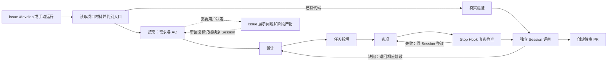

# Harness Engineering 脚手架

**业务实验入口：[reading_list](https://github.com/big91987/reading_list)。本仓库维护脚手架，不在这里发业务测试 Issue。**

Workflow 和 Issue 表单由模板首次复制，之后归业务仓库 Owner 维护；工具链升级不覆盖它们。模板差异可单独查看，见 [Workflow 定制](docs/workflow-ownership.md)。

版本同步与分工见 [仓库边界](docs/repository-boundaries.md)。以下使用流程在 业务项目 执行。

用 GitHub Issue／PR 提交研发任务，本机 Agent 读取完整项目上下文并交付代码或文档。产品类型和技术栈由用户与项目决定。验证方式由项目选择；未配置可执行验证器时明确标记“待验证”，不强行生成网页，也不宣称通过验收。详见 [项目配置](docs/project-configuration.md)。

## 新增：独立完整研发流程

新增的 **Full development workflow** 与下文原流程并存。入口为 `/develop`、`harness-full` 标签或手动执行；使用原生 Codex Session 续接，按需求、设计、规划、实现、独立评审、交付分阶段展示。原 `/harness` 流程未改动。

- [完整搭建、使用与限制](templates/full/docs/harness-full.md)
- [可由项目 Owner 修改的 Workflow 模板](templates/full/.github/workflows/harness-full.yml)
- [项目路径与检查配置](templates/full/.harness/full.json)
- [固定版本安装脚本](scripts/install_full.py)
- [阶段运行器](full_harness/runner.py) · [Codex Session 适配](full_harness/codex.py) · [原生 Stop Hook](full_harness/stop_hook.py)



所有阶段都能暂停澄清；图中只画出一条示例。需求、设计和规划各有独立文档评审。默认不部署网站，验证命令必须由项目配置。当前仅支持同一持久化本地 Runner；云端状态存储尚未实现。以下内容说明原有 Workflow。

## 怎么试

1. 仓库所有者打开 **Issues → New issue → 交给 Agent 处理研发任务**，描述需求。带 `harness` 标签的新 Issue 自动开始。默认先只读澄清；模板选择“直接实施”可跳过首轮确认。
2. 也可以在已有 Issue 或同仓库 PR 评论 `/harness 你的要求`。普通聊天不触发执行。`/harness clarify 需要检查的问题` 强制本轮只读澄清。
3. Agent 如果需要澄清，会在原页面问你，然后结束 Job。回复 `/harness 你的回答`，它会恢复原工作区继续。
4. 执行结束后，原页面会出现结果和任务分支。项目配置浏览器验证时额外提供预览与截图；未配置验证器时标记待验证。
5. 有意见继续回复 `/harness 修改意见`。每轮预览有独立地址，旧版本不会被覆盖。
发布失败但业务检查已通过时，回复 `/harness publish` 可只重试预览发布，不再调用模型。

6. 点击“查看改动／创建 PR”进入 GitHub 审查；不自动批准或合并。

先一次只提交一个命令，等结果回来再回复。初期流水线全局串行；GitHub concurrency 不是完整 FIFO 队列，短时间连续提交多个待执行命令可能替换 pending run。被取消的命令可以在前一轮完成后重发。

**示例：** 做一个团队待办板，支持创建、完成、筛选、删除，刷新后保留。先问我一个需要确定的问题，等我回答再实现。

## 入口和执行边界

- 只有仓库所有者能启动／重新运行本地任务；外部评论不会运行本机代码。
- 工作流固定从默认分支读取 Harness 程序，不执行 PR 自带的工作流或安装脚本。
- PR 接入导入完整普通文件工作区；不支持 fork PR。
- 实现提交完整项目内的变更，禁止任务修改 Harness 控制文件。外部修改任务分支时拒绝覆盖，需要重新对齐工作区。
- 每轮最多 3 次实现／浏览器检查；每次 Agent 调用限时 8 分钟，整个工作 Job 限时 30 分钟。
- `/harness stop` 停止后续推进。中断正在执行的任务请到 Actions 点击 **Cancel workflow**；停止评论不会抢占当前 Job。
- 自动浏览器路径来自实现方的 `acceptance.json`，不是独立产品验收；截图也不能证明所有功能正确。

## 状态保存在哪

```text
<work-root>/
  he_skeleton/                  # Harness 源码
  he_skeleton_runner/
    runtime/                    # Runner 程序和私有注册信息
    jobs/                       # 可丢弃的 Actions checkout
    tools/                      # 固定版本 Playwright 和 Chromium
    sessions/<issue-or-pr>/
      state.json                # 任务状态、用户反馈、Agent 总结、已处理事件
      workspace/                # 跨轮保留的完整项目
      round-*/                  # 私有调用记录和验证证据
    previews/task-*/round-*/     # 可长期打开的固定版本网页和截图
```

Session 独立于进程和 Job。第一版用持久化任务历史＋工作区启动新 Codex 调用，不依赖原生会话 ID，也不声称恢复模型内部状态。没有跨机器备份，删除 `sessions/` 会丢失本地检查点；请保留该目录。

## 工程实现

- `templates/.github/workflows/harness.yml`：默认研发流程模板，首次安装复制到业务仓库 `.github/workflows/harness.yml`；之后由 Owner 定制。
- `harness/loop.py`：命令解析、检查点、有限修复循环、分支交付和公开结果。
- `harness/agent.py`：Codex 适配；读取现有本机登录，使用 HTTPS，单次调用不加载用户工具配置。没有复制登录凭据到仓库。
- `harness/browser.cjs`：固定 Playwright 执行器，只允许有限的声明式点击／输入／断言；不在宿主机执行 Agent 生成的测试脚本。浏览器禁止外部网络请求。
- GitHub Pages：托管静态预览，Job 结束或本机休眠后已发布的网页仍可访问。预览公开，使用虚构实验数据。

各轮预览和会话暂不自动清理，先保留证据；长时间使用需人工清理或增加保留策略。本地 Runner 是目录分离，不是 OS 沙箱；当前使用同一 macOS 账户，仅适合所有者受控实验。

## 运维与验证

在 Runner 的 `runtime/` 目录执行 `./svc.sh status`、`./svc.sh stop` 或 `./svc.sh start`。Mac 需保持开机、联网，才能接新任务。

```sh
python3 -m unittest discover -s tests -v
node --check harness/browser.cjs
```

依赖：Python 3、Node、已登录的 Codex CLI（本机验证版本 0.151.0）、Runner 2.337.0；`tools/` 安装 Playwright 1.58.2 和对应 Chromium。Pages 设置为 GitHub Actions 发布。不启用 Actions 审批 PR 的额外权限。

Runner 连通验证：[实际通过的运行](https://github.com/big91987/he_skeleton/actions/runs/35201703061)。完整链路以实验 Issue 中的实际运行、预览和反馈记录为准。
