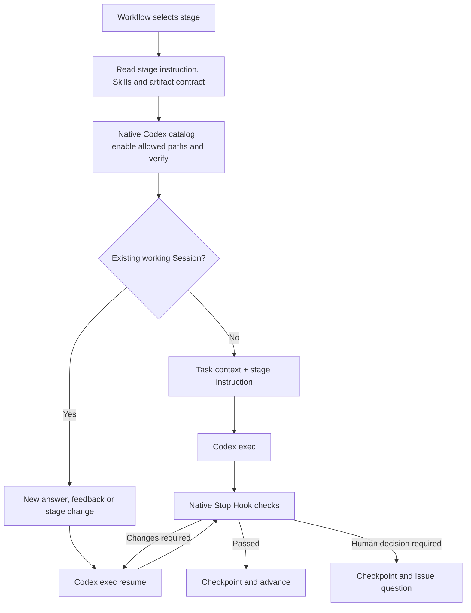

# Stage-configured native Agent execution

The accepted correction is to preserve native Skill progressive disclosure, constrain available Skills per stage, and resume the working Session using incremental input. Do not copy SKILL.md bodies into model prompts.

`runner.py run_agent()` provides one common execution path for the four authoring stages. It does not implement their business methods. Stage configuration determines the instruction, allowed Skills, input pointers and handoff artifact. Independent entry/review Agents have separate configurable Skill scopes and sessions. `skills.py` adapts native discovery/enablement only; it never parses or injects Skill bodies. `codex.py` owns the CLI call and native Session ID. `stop_hook.py` owns evidence checks and document review before accepting a stage.

See `templates/full/docs/harness-full.md` for configuration and the boundary between current Skill availability and retained Session history.
