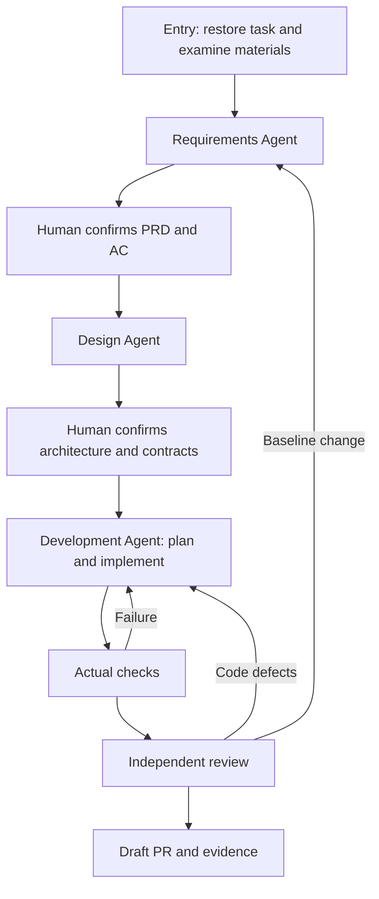

# Three-stage execution

One Workflow exposes entry, requirements, design, development and report. The three business stages use the same Agent adapter with different configured native Skill scopes, input pointers and output contracts. The controller owns human-confirmation state, actual checks and advancement; Skills own the working methods.

Requirements and design always stop for explicit, revision-bound human confirmation, including reused materials. Clarification answers and review feedback do not implicitly approve a document. Development owns task breakdown, implementation, verification, independent review, automatic repair and delivery as internal steps. It only stops early for a missing human decision, baseline reapproval, environmental blockage or bounded failure.

Native Session persistence and progressive Skill loading are described in `templates/full/docs/harness-full.md`, including the pilot's fixed-Runner/fixed-baseline constraints.
