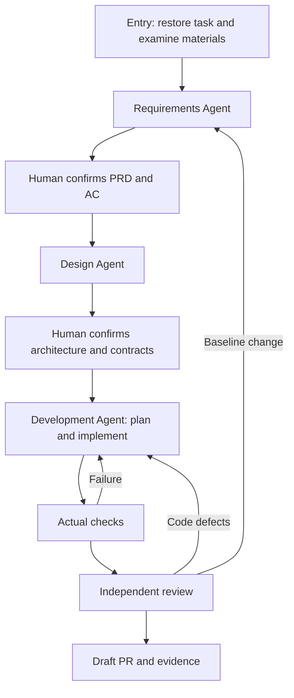

# Three-stage execution

One Workflow exposes entry, requirements, design, development and report. The three business stages use the same Agent adapter with different configured native Skill scopes, input pointers and output contracts. The controller owns human-confirmation state, actual checks and advancement; Skills own the working methods.

Requirements and design always stop for explicit, revision-bound human confirmation, including reused materials. Clarification answers and review feedback do not implicitly approve a document. Development owns task breakdown, implementation, verification, independent review, automatic repair and delivery as internal steps. It only stops early for a missing human decision, baseline reapproval, environmental blockage or bounded failure.

Native Session persistence and progressive Skill loading are described in `templates/full/docs/harness-full.md`, including the pilot's fixed-Runner/fixed-baseline constraints.

## Natural conversation

Authorized Issue replies resume the task's native Session with the current stage's native Skill scope. A read-only model turn sees current state, pending artifacts and recent conversation, then chooses one of three actions:

| Intent | Controller behavior |
| --- | --- |
| `answer` | Reply without executing work or changing stage; includes requests to hold off. Ambiguous requests get a clarifying question. |
| `continue_stage` | Continue clarification, revision or execution in the current stage. If artifacts were awaiting approval, invalidate that pending version and regenerate it for review. |
| `approve` | Validate consent to the current pending artifacts, message time and file hashes, record approval, then enter the next stage. |

There are no required phrases. Context determines whether a short reply agrees to a pending review or asks to continue current work. The controller receives approval as an explicit decision, never as a magic word in the user's text. A request to hold off does not interrupt an already-running job; Actions cancellation remains a separate operation.

The continuation turn resumes the same Session with the user's new message and latest state. Skills stay progressively disclosed through native configuration; their full text is not concatenated into prompts. Issue replies remain chronological and append-only.
